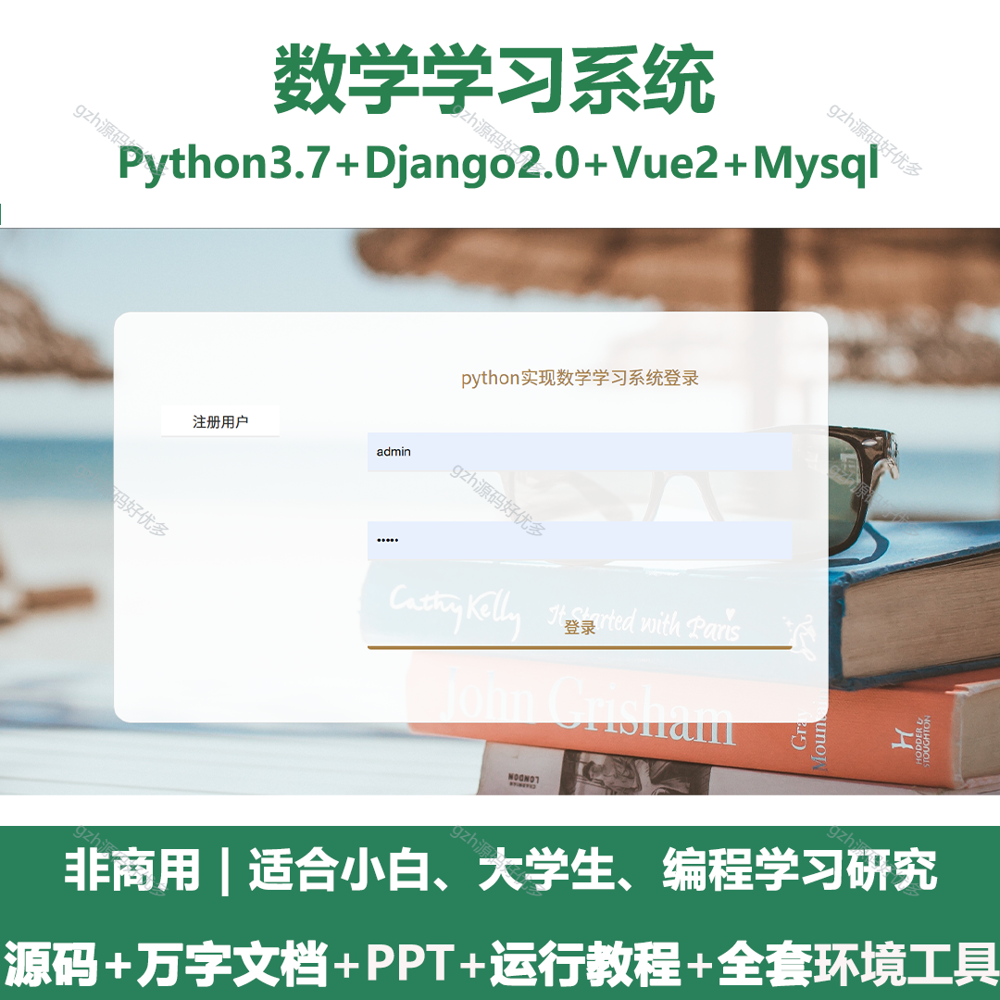
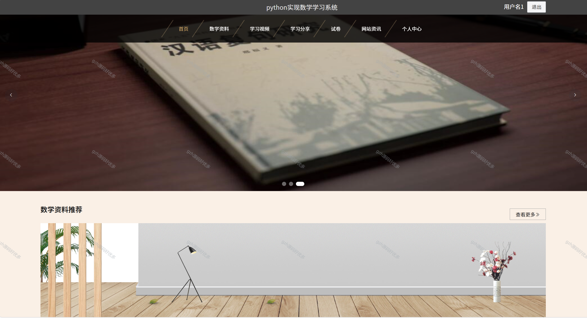
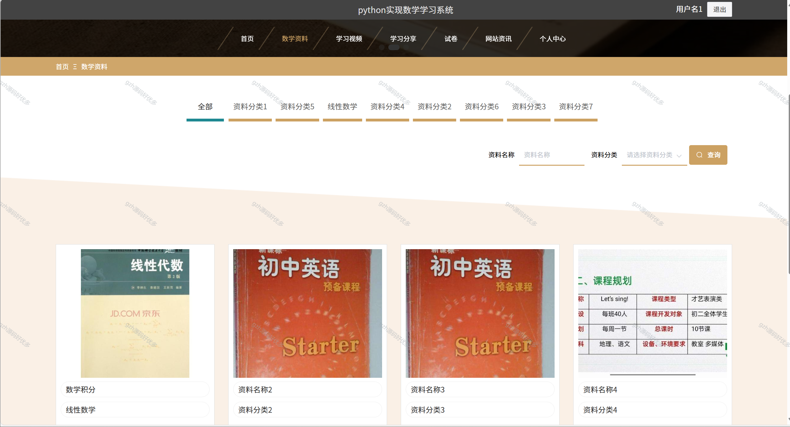
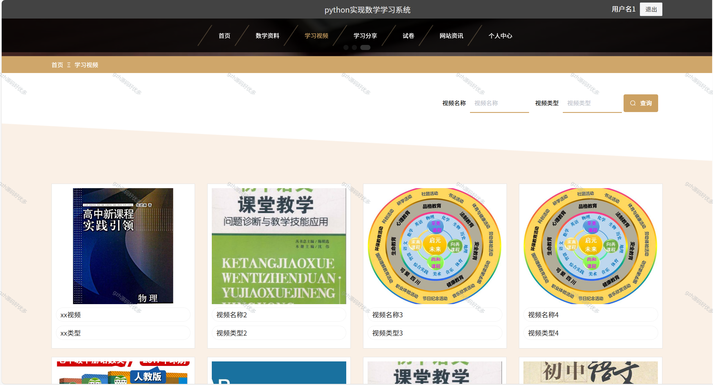
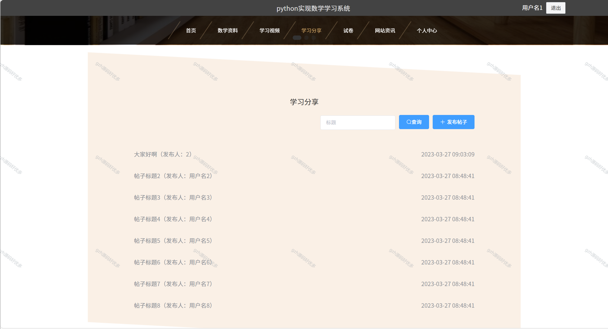
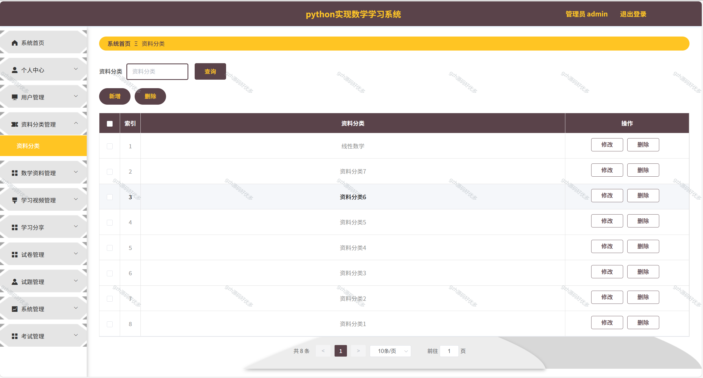
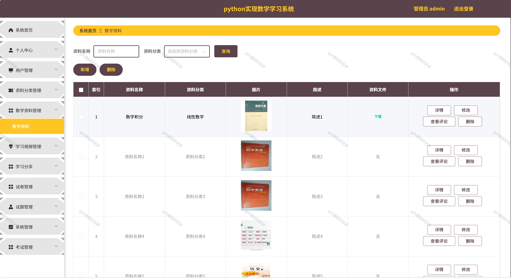
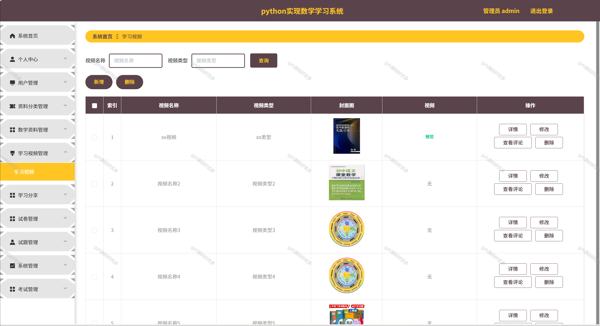
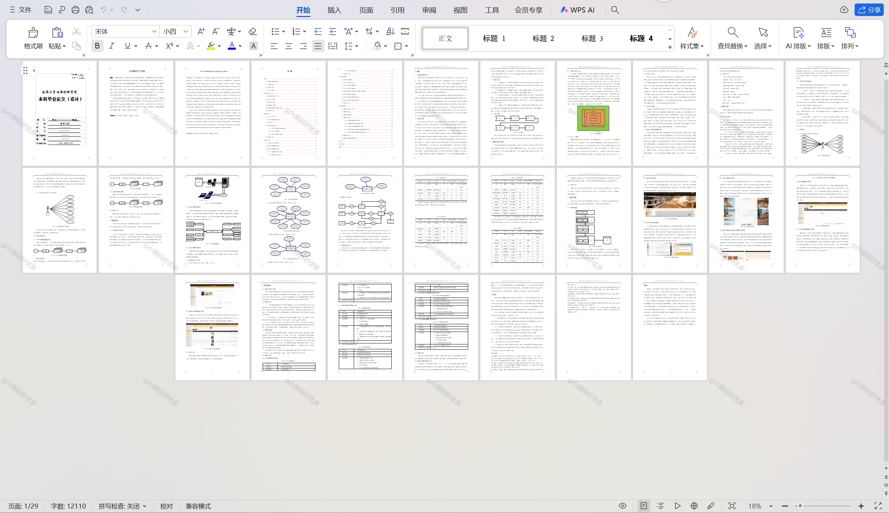

# python056
python056基于Python+Django的数学学习系统+LW+PPT
 
## 查看主页获取源码

### 一、关键词
数学学习体系，数学学习平台，数学学习系统

### 二、作品包含
源码+数据库+万字文档+PPT+全套环境和工具资源+本地部署教程

### 三、项目技术
前端技术：Vue2.0、Element-ui
后端技术：Python3.7、Django2.0

### 四、运行环境（以下版本亲测，其他版本未知，请自测）
开发工具：PyCharm + VSCODE

数据库：MySQL5.7（最低要5.7版本）

数据库管理工具：Navicat10+

Python：Python3.7

前端Nodejs：14

浏览器：谷歌浏览器

### 五、项目介绍
项目编号：python056

通过使用专门实现数学学习系统，校方管理员除了可以有效管理各类学生和课程信息之外，还可以发布试卷信息到系统中，让学生在线考试，方便管理员对于学生成绩的管理。
系统是基于Django框架的，采用python进行编写，使用mysql进行数据库的管理，使用navicat作为图形界面操作数据库，采用B/S架构进行系统的开发。系统采用流行的vue.js前台框架进行页面的设计与开发，后台采用顶而下的开发方法，提高系统的系统可维护性和拓展性，并实现了相关功能，经过测试，系统能够完成预设的基本功能，实现线上教学的全过程。

### 六、运行截图

